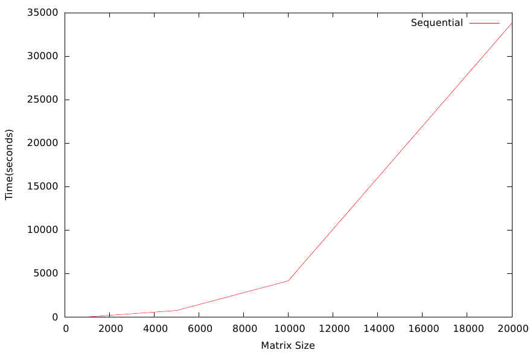
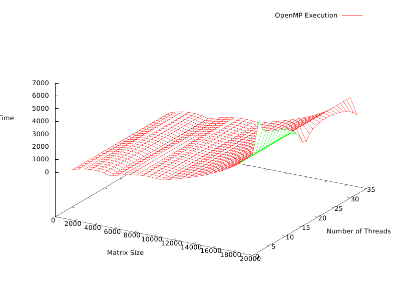
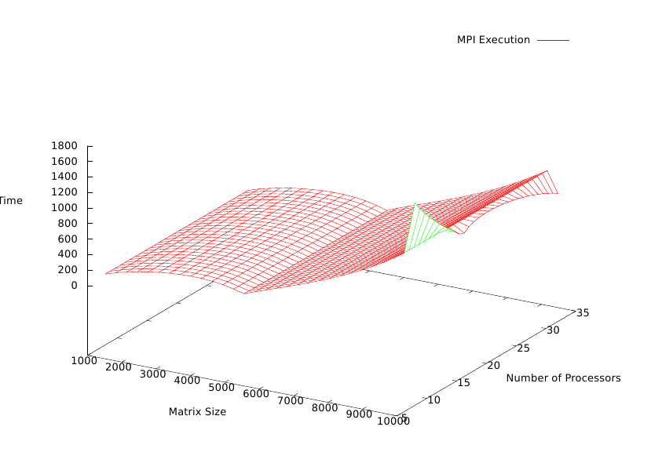
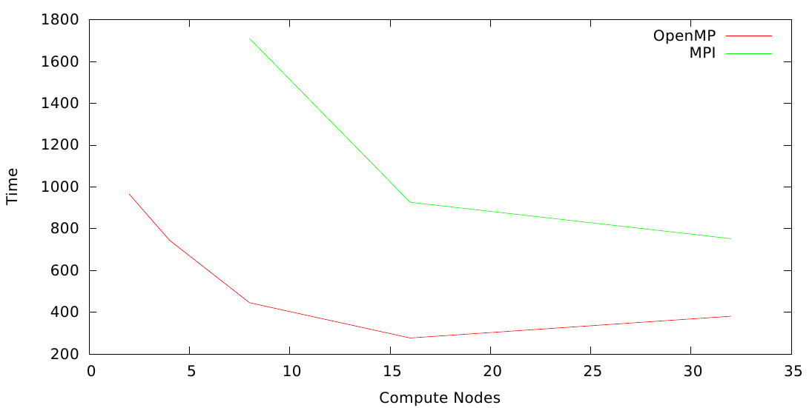
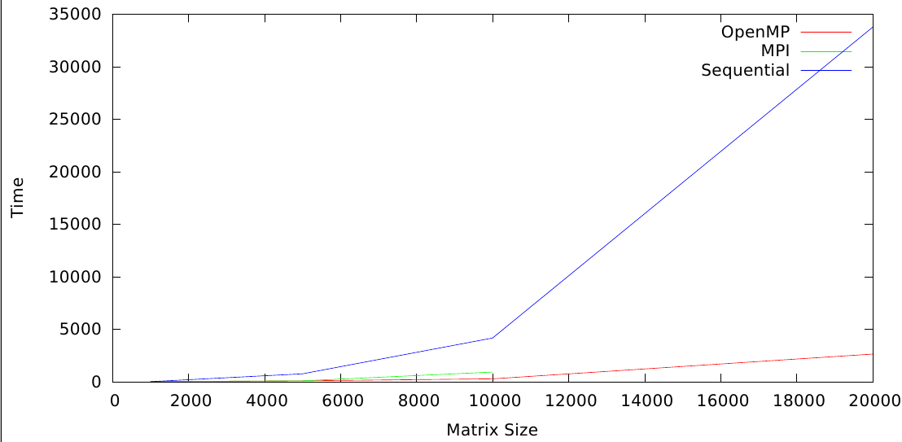

Parallel Implementation of LU decomposition
======

###Basics
======

-   Root directory contains three sub-directories namely ’Sequential’,
    ’OpenMP’ and ’MPI’.

-   Each subdirectory has source code in the form of ** ’\*.c’** file.

-   Matrix is generated in a manner that it decomposes into a L and U
    containing only 1s and 0s.

-   To submit jobs for various configurations run **’./submit.sh’** on
    terminal. This will automatically submit all the jobs in the
    subdirectory to the **general-compute** queue of the ccr cluster.

-   Outputs are generated in the **output.txt** file. *Sample outputs
    are included*.

-   In the corresponding subdirectory run **./plot.sh** on the linux
    terminal to generate a graphical visualization of the output.
    *gnuplot is required to generate graph*.

-   Graphs are generated as **’Plot.pdf’**. *Please wait for the job run
    to finish and outputs to accumulate*.

###Sequential Implementation
=========================

-   Gaussian elimination algorithm was implemented that sequentially
    decomposes the square matrix.

-   Algorithm was evaluated on input matrix size of 1000, 5000, 10000,
    20000.

-   Time taken to decompose the matrix grew exponentially with the
    increase in size.

-   Since, this was a sequential implementation increase in compute
    nodes won’t do anything.

-   Since I was using Gaussian elimination that computes L and U
    matrices separately, I ran **out of memory** when matrix size of
    50,000 was tried. This implementation makes two copies of the matrix
    of same size as input.

###OpenMP Implementation
=====================

-   Gaussian elimination algorithm was implemented that uses the block
    wise decomposition in parallel.

-   The **for** loops are parallelized in a manner that blocks of
    matrices are decomposed by dividing the work among parallel threads.

-   Algorithm was evaluated for input matrix of sizes 1000, 5000, 10000,
    20000 with a combination of 2, 4, 8, 16, 32 threads executing in
    parallel.

-   On a fixed workload the decompostion was faster when more threads
    are executing in parallel. The execution was comparatively faster on
    larger workload due to the fact, parallelism was more effective.

-   For a fixed number of cores the time increased exponentially with
    increase in matrix size.

-   The parallelism was ineffective on relatively smaller loads.

-   Since I was using Gaussian elimination that computes L and U
    matrices separately, I ran **out of memory** when matrix size of
    50,000 was tried. This implementation makes two copies of the matrix
    of same size as input.

###MPI Implementation
==================

-   Cyclic distribution was used to accomplish LU factorization of the
    input square matrix.

-   Each node is responsible for computing its own block and broadcast
    the result to rest of the nodes.

-   Algorithm was evaluated for input matrix of sizes 1000, 5000, 10000
    with a combination of 8, 16, 32 compute nodes working in parallel.

-   For a fixed number of compute nodes the algorithm showed uniform
    behavior.

-   For fixed workload the parallelism was more effective for larger
    workloads on maximum compute nodes.

Comparison
==========

-   Since, MPI involves communication overhead between different nodes,
    it was slower as compared to OpenMP.

    

-   As expected sequential algorithm turns out to be the worst performer
    of the three.

    

###Scalability
===========

LU factorization algorithm has a great extent of parallelization when
scaled appropriately.
